# Geopolítica, Crudo WTI y Mercados Financieros: Análisis Predictivo e Inteligencia en Tiempo Real

**Proyecto de portfolio
---

## Resumen 

Este proyecto estudia la relación entre la geopolítica global, el mercado del crudo WTI y el contagio de los shocks energéticos al sistema financiero. A lo largo de tres fases metodológicamente encadenadas se construye, valida y activa sobre un evento real extremo una arquitectura analítica que va desde la ingeniería de variables históricas hasta la inferencia cruzada con mercados de predicción en tiempo real.

La pregunta central es: **¿puede la señal geopolítica anticipar, con un día de antelación, días de alta tensión en el mercado del crudo WTI?** La respuesta es matizada pero rigurosa. La señal existe —AUC = 0,615 frente al 0,50 del clasificador aleatorio, recall = 0,918— pero no supera la eficiencia informacional que ya incorpora el propio mercado a través de sus indicadores de volatilidad. Los indicadores OVX, VIX y DXY predicen mejor los shocks en el crudo que los indicadores geopolíticos externos (GPR, GDELT). Ese resultado no es un fracaso: es en sí mismo una conclusión coherente con la hipótesis de mercados semi-eficientes.

La Parte 3 aplica el modelo y el historial empírico sobre un escenario real sin precedente: el 23 de marzo de 2026, con guerra EEUU-Irán activa, el Estrecho de Ormuz bloqueado, WTI con una subida acumulada del +71,23% desde comienzos de año, y el mayor swing intradiario registrado en la historia del contrato (-14,42% en cinco minutos), desencadenado por un post de Donald Trump en Truth Social.

---

## Tabla de contenidos

1. [Bases de datos y fuentes](#1-bases-de-datos-y-fuentes)
2. [Polymarket como herramienta de anticipación](#2-polymarket-como-herramienta-de-anticipación)
3. [Objetivos del proyecto](#3-objetivos-del-proyecto)
4. [Estructura del proyecto](#4-estructura-del-proyecto)
5. [Desarrollo metodológico](#5-desarrollo-metodológico)
6. [Resultados y figuras (Bloques 1–5)](#6-resultados-y-figuras-bloques-15)
7. [Conclusiones de la Parte 1](#7-conclusiones-de-la-parte-1)
8. [Conclusiones de la Parte 2](#8-conclusiones-de-la-parte-2)
9. [Conclusiones de la Parte 3](#9-conclusiones-de-la-parte-3)
10. [Interpretación integrada](#10-interpretación-integrada)
11. [Bloque 6 — Comparativa Ucrania 2022 vs. EEUU-Irán 2026](#11-bloque-6--comparativa-ucrania-2022-vs-eeuu-irán-2026)
12. [Bloque 7 — Análisis de correlaciones rodantes](#12-bloque-7--análisis-de-correlaciones-rodantes)
13. [Sub-bloque 4.6 — Semáforo de salida del régimen](#13-sub-bloque-46--semáforo-de-salida-del-régimen)
14. [Estructura de carpetas](#14-estructura-de-carpetas)
15. [Reproducibilidad](#15-reproducibilidad)

---

## 1. Bases de datos y fuentes

El proyecto integra ocho fuentes de datos que cubren horizontes temporales, frecuencias y naturalezas distintas. Cada fuente aporta una capa de información diferente sobre el fenómeno estudiado.

### 1.1 Precio del crudo WTI (`wti_usa_clean.csv`)

Serie diaria del precio spot del WTI en dólares por barril, desde enero de 1986 hasta marzo de 2026 (~10.100 observaciones). Fuente: FRED (Federal Reserve Economic Data, serie DCOILWTICO). Es el eje central del proyecto: variable a explicar, referencia para el cálculo de retornos y percentiles históricos, y base para la definición del target de clasificación.

En el snapshot del 23 de marzo de 2026, WTI a 98,32 USD/barril corresponde al percentil 96,8 del histórico desde 2015, nivel superado solo en el 3,2% de los días de negociación del periodo de entrenamiento.

### 1.2 Volatilidad implícita del crudo: OVX (`ovx_clean.csv`)

El OVX (CBOE Crude Oil Volatility Index) mide la volatilidad implícita de las opciones sobre el ETF USO, equivalente del VIX para el mercado del petróleo. Disponible desde 2007 (~4.745 observaciones). Fuente: CBOE vía Yahoo Finance.

Es la variable más importante del modelo: `ovx_lag1` ocupa la primera posición SHAP (valor medio 0,0989) y `ovx_high_dummy` (OVX superior al percentil 80 histórico) la segunda (0,0754). El 23 de marzo de 2026, OVX estaba en 91,85 —percentil 98,6 de su historia desde 2007—, más de dos veces por encima del umbral de alerta del modelo (40 puntos).

### 1.3 Volatilidad macro: VIX y DXY (`vix_clean.csv`, `dxy_clean.csv`)

El VIX mide la volatilidad implícita del S&P 500 (termómetro global de aversión al riesgo). El DXY es el índice del dólar ponderado por comercio. Ambas series forman el grupo `vix_dxy`, que aporta seis de las diez variables más importantes del modelo según SHAP.

El DXY merece atención especial: sus valores rezagados 1, 3 y 5 días están entre las diez variables más predictivas, lo que sugiere que el mercado de divisas incorpora información sobre el riesgo geopolítico con cierta anticipación respecto al crudo. Rango observado: DXY 72,93–114,11 (2010–2026); VIX 9,14–82,69 (1990–2026).

### 1.4 Índice de Riesgo Geopolítico: GPR (`gpr_clean.csv`)

Elaborado por Caldara e Iacoviello (2022, *American Economic Review*), el GPR cuantifica el riesgo geopolítico global mediante recuento de noticias de tensión militar, conflictos armados y guerras en prensa de referencia. Serie desde 1985 (~15.050 observaciones). Se descompone en `gpr_act` (actos materializados) y `gpr_threat` (amenazas percibidas).

El umbral crítico del modelo se sitúa en GPR > 120 (aproximadamente el percentil 75 histórico). El 23 de marzo de 2026, GPR estaba en 248,8 —percentil 97,8 del histórico completo desde 1985—. Solo doce precedentes en cuarenta años presentan niveles comparables, todos en contextos de guerra activa.

### 1.5 GDELT: Eventos Geopolíticos Diarios (`gdelt_clean.csv`)

El proyecto GDELT (*Global Database of Events, Language and Tone*) procesa noticias en tiempo real de miles de fuentes y codifica eventos según el sistema CAMEO. Se extraen variables diarias para zonas productoras: recuento de eventos, menciones, tono medio, escala Goldstein media y mínima, y categorías de eventos militares, diplomáticos y de acuerdos.

La escala Goldstein va de -10 (máxima conflictividad) a +10 (máxima cooperación). La media histórica en el dataset es -3,38, coherente con el carácter estructuralmente conflictivo de las zonas productoras. La variable de interacción `goldstein_x_ovx` ocupa la cuarta posición SHAP (0,0493).

**Limitación detectada:** a partir de 2020 el volumen de eventos GDELT cae aproximadamente un 70%, no por reducción de la actividad geopolítica real sino por cambios en los patrones de cobertura de las fuentes primarias. Se mitiga construyendo ratios relativos en lugar de recuentos absolutos.

### 1.6 Brent y spread WTI-Brent (`brent_clean.csv`)

El diferencial WTI-Brent refleja condiciones de oferta relativa entre los mercados norteamericano y europeo, y es sensible a bloqueos de rutas de transporte y capacidad de infraestructuras de exportación.

### 1.7 Datos de mercado en tiempo real (yfinance)

Para el snapshot del 23 de marzo de 2026 se descargaron mediante `yfinance` series históricas e intradiarias de 5 minutos para trece activos: WTI (CL=F), Brent (BZ=F), OVX (^OVX), VIX (^VIX), DXY (DX-Y.NYB), S&P 500 (^GSPC), NASDAQ (^IXIC), Oro (GC=F), Plata (SI=F), ExxonMobil (XOM), Chevron (CVX), Bono 10Y EEUU (^TNX) y Bitcoin (BTC-USD). Las series históricas se extienden desde el 27 de febrero de 2026 (inicio de la guerra EEUU-Irán).

### 1.8 Mercados de predicción: Polymarket API

Polymarket es una plataforma descentralizada de mercados de predicción (blockchain Polygon, USDC). Se accede a su API pública (`gamma-api.polymarket.com/markets`) sin autenticación. Para la Parte 3 se recuperaron **717 mercados relevantes** tras un sistema de filtrado de tres capas: palabras clave geopolíticas/financieras, umbral de liquidez (≥ 5.000 USD) y volumen 24h (≥ 1.000 USD).

---

## 2. Polymarket como herramienta de anticipación

### 2.1 Fundamento informativo

Los mercados de predicción con incentivos económicos reales tienden a converger hacia probabilidades bien calibradas. En entornos de alta incertidumbre geopolítica —exactamente el entorno que estudia este proyecto— ofrecen algo que las series históricas no pueden: una lectura agregada en tiempo real de qué escenarios considera el mercado como plausibles, con qué probabilidad y a qué horizonte.

La integración de Polymarket en la Parte 3 responde a esta lógica: no reemplaza el modelo histórico, sino que cruza sus conclusiones con las expectativas actuales del mercado para detectar divergencias analíticamente significativas.

### 2.2 Discusión crítica

**Liquidez y representatividad.** Los mercados más líquidos de Polymarket alcanzan volúmenes diarios superiores al millón de dólares. Sin embargo, muchos mercados geopolíticos específicos presentan liquidez significativamente menor, lo que aumenta la sensibilidad a posiciones individuales. La métrica `signal_quality_score` incorpora un componente de liquidez normalizada precisamente para penalizar señales potencialmente distorsionadas.

**Sesgos de participación.** La plataforma tiene un sesgo hacia perfiles angloparlantes con exposición a activos digitales, lo que puede distorsionar probabilidades en mercados con distribución geográfica desigual del conocimiento relevante.

**Riesgos técnicos.** Los mercados con liquidez limitada son susceptibles a *wash trading* y arbitraje asimétrico.

**Ética.** La posibilidad de beneficiarse económicamente apostando sobre guerras o muertes en combate genera un rechazo legítimo que este proyecto reconoce explícitamente, sin tomar posición moral, al usar Polymarket como fuente en un contexto de conflicto armado activo.

En síntesis: Polymarket se usa aquí como fuente auxiliar de expectativas, con cautela metodológica explícita, y nunca como señal primaria o validación independiente.

---

## 3. Objetivos del proyecto

### Parte 1: Dataset maestro y modelo predictivo

- Construir un dataset histórico diario (2010-2026) que integre precio del crudo, volatilidad implícita, indicadores geopolíticos (GPR, GDELT) y variables macroeconómicas relacionadas.
- Definir una variable objetivo binaria (`high_stress_day`) que capture días de alta tensión en el WTI: retorno absoluto superior al percentil 80 del entrenamiento (2,47%) O variación diaria del OVX superior al percentil 80 (1,042 puntos).
- Evaluar si la señal geopolítica predice días de alta tensión con un día de antelación, sin fuga de información temporal.
- Comparar algoritmos (regresión logística, Random Forest, XGBoost) e identificar el mejor modelo bajo la restricción de no usar datos futuros para entrenar.

### Parte 2: Modelado dinámico de regímenes y simulación

- Extender el análisis desde clasificación binaria hacia modelación dinámica del régimen de volatilidad del crudo.
- Calibrar un modelo RSJD (Regime-Switching Jump-Diffusion) con parámetros diferenciados para el régimen normal y el de alta tensión.
- Construir un ABM (Agent-Based Model) con cuatro tipos de agentes —pasivo, geopolítico, momentum y especulador— y evaluar estrategias de cobertura.
- Cuantificar el valor económico de incorporar señales geopolíticas en carteras expuestas al crudo.

### Parte 3: Inteligencia en tiempo real

- Activar el modelo histórico sobre un evento real extremo (23 de marzo de 2026) y evaluar su comportamiento en condiciones fuera del dominio de entrenamiento.
- Construir un sistema de ingesta, clasificación y puntuación de señales Polymarket.
- Cruzar probabilidades implícitas de Polymarket con inferencias del modelo histórico para detectar coincidencias, divergencias y señales mixtas.
- Producir un informe ejecutivo estructurado.

---

## 4. Estructura del proyecto

El proyecto se organiza en tres fases metodológicamente dependientes:

```
Parte 1 ─── Dataset histórico ─── Modelo predictivo ──┐
                                                        ├── Parte 3: Inteligencia en tiempo real
Parte 2 ─── Regímenes RSJD ────── Estrategias ABM ────┘
```

La Parte 3 no es independiente: sus inferencias tienen valor analítico precisamente porque se apoyan en parámetros empíricos derivados de cuarenta años de historia del crudo y en un modelo validado sobre datos fuera de muestra (2021–2026).

### Notebooks

| Notebook | Descripción |
|----------|-------------|
| `notebooks/parte3_completo.ipynb` | Notebook unificado con los cinco bloques de la Parte 3 |
| `notebooks/01_polymarket_ingesta.ipynb` | Ingesta Polymarket: fetch API, filtrado, clasificación |
| `notebooks/02_market_snapshot.ipynb` | Snapshot de mercado: percentiles históricos, evento Trump |
| `notebooks/03_polymarket_taxonomia.ipynb` | Taxonomía: heatmap, ranking, curvas implícitas, síntesis |
| `notebooks/04_inference_engine.ipynb` | Motor de inferencia cruzada: 12 escenarios, semáforo |
| `notebooks/05_intelligence_brief_dashboard.ipynb` | Brief ejecutivo |

---

## 5. Desarrollo metodológico

### 5.1 Dataset maestro y construcción del target (Parte 1)

El dataset maestro cubre desde enero de 2010 hasta marzo de 2026 (4.059 días hábiles, 37 columnas). El corte train/test se fijó en enero de 2021, proporcionando 2.762 días de entrenamiento (2010–2020) y 1.297 de validación fuera de muestra (2021–2026). No se usaron en ningún momento datos futuros para entrenar el modelo.

La variable objetivo `high_stress_day` es binaria:

```
high_stress_day(t) = 1  si  |retorno_t+1| > P80_train(0,0247)
                          O  delta_OVX_t+1 > P80_train(1,042)
```

La doble condición captura tanto movimientos extremos de precio como incrementos bruscos de volatilidad implícita. El resultado: 33,2% de días positivos en el total, desequilibrio moderado que justifica el uso de F1 como métrica principal.

### 5.2 Ingeniería de variables (Parte 1)

Se construyeron **67 variables predictoras** en cinco grupos:

| Grupo | Variables | Descripción |
|-------|-----------|-------------|
| mercado | 16 | Retornos, volatilidades móviles (5/10/20d), OVX y transformaciones |
| VIX/DXY | 16 | Rezagos (1/3/5/10d) y medias móviles de VIX y DXY |
| GDELT | 24 | Recuento por categoría CAMEO, tono, Goldstein, rezagos |
| GPR | 6 | GPR global, `gpr_act`, `gpr_threat`, rezagos |
| interacciones | 5 | Productos cruzados entre grupos; el más relevante: `goldstein_x_ovx` |

Todas las variables usan desplazamientos temporales de al menos un día (`.shift(lag ≥ 1)`) para garantizar que en la predicción del día `t+1` solo se usa información disponible al cierre del día `t`.

### 5.3 Selección del modelo (Parte 1)

Se evaluaron seis configuraciones de tres familias de modelos con validación cruzada temporal (`TimeSeriesSplit`, n_splits=5):

| Modelo | F1 | AUC |
|--------|----|-----|
| Regresión Logística (mercado) | 0,552 | 0,585 |
| Regresión Logística (todas vars) | 0,541 | 0,578 |
| **Random Forest (todas vars, md=3, thr=0,46)** | **0,571** | **0,615** |
| Random Forest (mercado, md=3, thr=0,44) | 0,555 | 0,614 |
| XGBoost (todas vars, thr=0,38) | 0,512 | 0,562 |
| XGBoost (mercado, thr=0,62) | 0,368 | 0,557 |

El Random Forest con 67 variables, profundidad máxima 3 y umbral 0,46 ofrece el mejor compromiso. La restricción de profundidad máxima es una decisión de regularización deliberada: árboles más profundos sobreajustan en entrenamiento sin mejorar la generalización. El umbral 0,46 (frente al 0,50 estándar) maximiza F1, asumiendo más falsas alarmas a cambio de no perder shocks reales —elección racional en gestión de riesgo energético.

### 5.4 Interpretabilidad SHAP (Parte 1)

Las diez variables más importantes del modelo por SHAP (SHapley Additive exPlanations):

| Rango | Variable | Grupo | SHAP medio | Descripción |
|-------|----------|-------|------------|-------------|
| 1 | `ovx_lag1` | mercado | 0,0989 | OVX del día anterior |
| 2 | `ovx_high_dummy` | mercado | 0,0754 | OVX > P80 histórico |
| 3 | `vol20_lag1` | mercado | 0,0537 | Volatilidad realizada 20d, lag 1 |
| 4 | `goldstein_x_ovx` | interacción | 0,0493 | Goldstein GDELT × OVX |
| 5 | `vol10_lag1` | mercado | 0,0490 | Volatilidad realizada 10d, lag 1 |
| 6 | `dxy_lag3` | VIX/DXY | 0,0295 | DXY rezagado 3 días |
| 7 | `dxy_rolling5` | VIX/DXY | 0,0288 | Media móvil DXY 5 días |
| 8 | `dxy_rolling10` | VIX/DXY | 0,0282 | Media móvil DXY 10 días |
| 9 | `dxy_lag1` | VIX/DXY | 0,0274 | DXY rezagado 1 día |
| 10 | `vix_lag3` | VIX/DXY | 0,0206 | VIX rezagado 3 días |

Las tres primeras posiciones son variables de memoria del propio mercado de crudo. El primer indicador geopolítico puro (GDELT) aparece en cuarta posición y solo en interacción con OVX. Ninguna variable GPR figura en el top 10.

### 5.5 Modelo RSJD y ABM (Parte 2)

El modelo RSJD (Regime-Switching Jump-Diffusion) calibrado sobre el dataset histórico identifica dos regímenes:

**Régimen normal:** baja volatilidad, deriva positiva moderada.

**Régimen de alta tensión (high_stress):**
- Deriva anual: +18,4%
- Volatilidad anualizada: 50,7%
- Tasa de saltos: λ = 3,2 saltos/año
- Probabilidad de persistencia: p_stay = 0,977
- Duración esperada del régimen: ~43 días

El ABM simula cuatro tipos de agentes (pasivo, geopolítico, momentum, especulador) y evalúa estrategias de cobertura. El fondo geopolítico diseñado en la Parte 2 reduce el drawdown máximo en un **72%** respecto al inversor pasivo. Sin embargo, el RSJD presenta un error de magnitud del **136,9%** (signo invertido en la extrapolación) para horizontes de varios meses fuera del dominio de calibración, lo que subraya la precaución necesaria al extrapolar el modelo.

### 5.6 Ingesta y clasificación de señales Polymarket (Parte 3, Bloque 1)

La ingesta implementa un filtrado de tres capas:

- **Capa 1:** palabras clave de primer nivel (oil, WTI, Iran, Hormuz, crude, geopolitic…)
- **Capa 2:** refinamiento semántico sobre el texto de las preguntas
- **Capa 3:** filtros cuantitativos (liquidez ≥ 5.000 USD, volumen 24h ≥ 1.000 USD, días hasta cierre ≥ 0)

De los miles de mercados activos el 23 de marzo de 2026 se retienen **717 mercados** en seis categorías:

| Categoría | Mercados | Prob. media | % In-domain | Días promedio |
|-----------|----------|-------------|-------------|---------------|
| supply_side | 185 | 14,0% | 100,0% | 95,3 |
| risk_assets | 239 | 42,6% | 97,9% | 37,3 |
| macro_derived | 133 | 14,6% | 100,0% | 135,8 |
| safe_haven | 47 | 17,9% | 93,6% | 69,8 |
| tail_risk | 36 | 3,1% | 25,0% | 103,0 |
| price_direct | 34 | 12,6% | 94,1% | 24,8 |

Para cada mercado se calcula `signal_quality_score` (SQS):

```
SQS = (0,35 × yes_prob_adj + 0,30 × liquidity_norm + 0,20 × volume_norm + 0,15 × time_weight)
      × analytical_relevance_multiplier × family_bonus
```

El multiplicador de relevancia penaliza categorías con baja relación directa con el análisis geopolítico-energético (`risk_assets` recibe 0,35 frente al 1,00 de `supply_side`), evitando que mercados de Bitcoin con alta liquidez dominen el ranking.

### 5.7 Snapshot de mercado y evento Trump (Parte 3, Bloque 2)

El snapshot del 23 de marzo de 2026 captura trece activos con valor actual, retorno YTD, percentil histórico y comportamiento intradiario.

El análisis intradiario es el núcleo del bloque. A las 11:05 UTC del 23 de marzo, WTI pasó de 98,59 a un mínimo de 84,37 USD/barril en una sola barra de cinco minutos: **-14,42% desde el cierre anterior**, el mayor swing intradiario registrado en la historia del contrato.

| Activo | Precio pre-evento | Precio en extremo | Variación | Reacción |
|--------|------------------|-------------------|-----------|----------|
| WTI | 98,59 | 84,37 | -14,42% | Panic reversal |
| VIX | 29,92 | 20,28 | -32,22% | Stress confirmed (desescalada leída) |
| Oro | 4.284,70 | 4.516,50 | +5,41% | Resilient (refugio activo) |
| Plata | 64,79 | 71,03 | +9,64% | Resilient |
| Bitcoin | 68.570,48 | 71.696,08 | +4,56% | Decorrelated |
| DXY | 100,13 | 98,88 | -1,25% | Weak dollar |

La simultaneidad de esos movimientos opuestos —crudo y VIX bajan, oro y Bitcoin suben— refleja una lectura colectiva de desescalada sin vuelta al apetito por el riesgo, que Irán desmintió pocas horas después.

### 5.8 Motor de inferencia cruzada (Parte 3, Bloque 4)

El motor construye cuatro vistas por escenario: historial empírico, inferencia del modelo, implicaciones condicionales y score de confianza:

```
Conf = 0,30 × SQS × 120 + 0,25 × precedent_strength + 0,25 × domain_score + 0,20 × alignment_score
```

**Tabla de inferencias completa (snapshot 23/03/2026):**

| Escenario | Prob. Poly | Convicción | Alineación | Conf. | Etiqueta |
|-----------|-----------|------------|------------|-------|----------|
| Fed pausa en abril | 95,35% | descontado | aligned | 86,7 | Alta |
| WTI > $105 | 41,05% | cola | aligned | 81,3 | Alta |
| WTI cae < $90 (fin de marzo) | 86,85% | muy_probable | partially_aligned | 74,5 | Media |
| Ormuz cerrado hasta abril | 55,50% | cola | aligned | 70,9 | Media |
| Cese el fuego antes del 15 abril | 39,50% | cola | partially_aligned | 64,6 | Media |
| S&P 500 en bear market | 12,00% | cola | partially_aligned | 58,9 | Media |
| Recesión EEUU en 2026 | 31,50% | cola | divergent | 49,8 | Baja |
| Fuerzas USA entran en Irán | 13,50% | cola | out_of_domain | 21,7 | OOD |
| Bitcoin como refugio geopolítico | 84,00% | muy_probable | out_of_domain | 15,1 | OOD |
| Oro cae durante la guerra | 17,40% | cola | out_of_domain | 15,1 | OOD |
| Ormuz cerrado hasta junio | 27,00% | cola | out_of_domain | 8,9 | OOD |
| WTI > $150 | 1,55% | cola | out_of_domain | 8,4 | OOD |

### 5.9 Perfil de estrés y canales de contagio (Parte 3, Bloques 4.1 y 4.5)

**Verificación del perfil de estrés** contra ocho dimensiones derivadas de los umbrales del modelo de la Parte 1:

| Dimensión | Valor actual | Umbral | Activa |
|-----------|-------------|--------|--------|
| OVX > umbral alerta modelo (40) | 91,85 | 40,0 | ✓ |
| OVX > P80 high_stress (46,1) | 91,85 | 46,1 | ✓ |
| GPR > umbral crítico (120) | 248,8 | 120,0 | ✓ |
| VIX > 25 | 26,78 | 25,0 | ✓ |
| WTI swing intradiario < -14% | -14,42% | -14% | ✓ |
| WTI > P90 histórico | P93,8 | P90 | ✓ |
| WTI en percentil extremo (>P95) | P93,8 | P95 | ✗ |
| TNX yield > P80 histórico | P87,9 | P80 | ✗ |

**Resultado: 6 de 8 dimensiones activas → ESTRÉS EXTREMO.**

**Canales de contagio sistémico identificados:**

| Canal | Cadena | Modelado | Resultado observado |
|-------|--------|----------|---------------------|
| Inflación→Tipos→Renta Variable | GPR↑→OVX↑→WTI↑→IPC↑→Fed pausa→yields↑→S&P↓ | Parcial | S&P más resiliente de lo esperado (-4,95% YTD) |
| Paradoja safe haven | GPR↑→inflación↑→tipos reales↑→ORO↓ | No | Canal de tipos reales dominó sobre refugio: oro -8,8% intradiario |
| Risk-off selectivo | GPR↑→VIX↑→S&P↓→BTC↑ | No | Bitcoin subió mientras WTI caía: posible desacoplamiento |
| Equity energético desacoplado | WTI↑→revenues XOM/CVX↑→outperformance | Parcial | XOM +33,6% YTD, CVX +34,8% YTD: canal confirmado |
| Factor Trump | Post red social→WTI -14% en 5min→Irán desmiente | No modelable | DIVERGENCIA MÁXIMA: primer caso de precio del crudo movido por red social |

---

## 6. Resultados y figuras (Bloques 1–5)

### Figura 1: Snapshot de mercados financieros

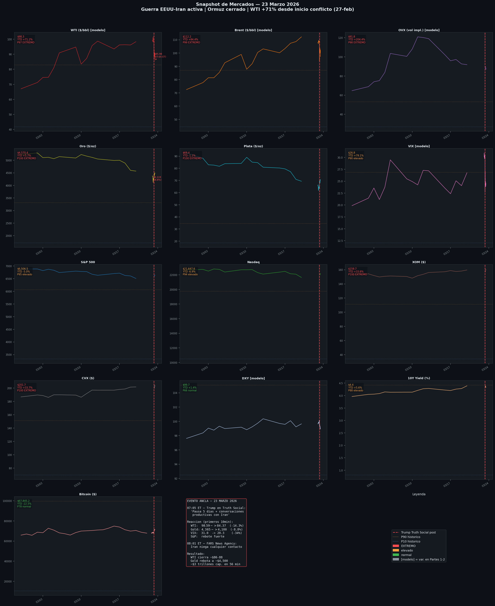

Estado de los trece activos el 23 de marzo de 2026. El snapshot muestra una estructura coherente con un shock energético extremo pero con asimetría sectorial: WTI (+71,23% YTD), OVX (+204,44% YTD), XOM (+33,57% YTD) y CVX (+33,66% YTD) en zona de máximo estrés histórico; S&P 500 (-4,95% YTD) y NASDAQ (-6,86% YTD) bajo presión moderada; DXY (+1,39% YTD) y Bitcoin (-22,47% YTD) en niveles relativamente normales. El perfil no es de crisis financiera global sino de shock sectorial con contagio parcial.

### Figura 2: Impacto del evento Trump (pre vs. post)

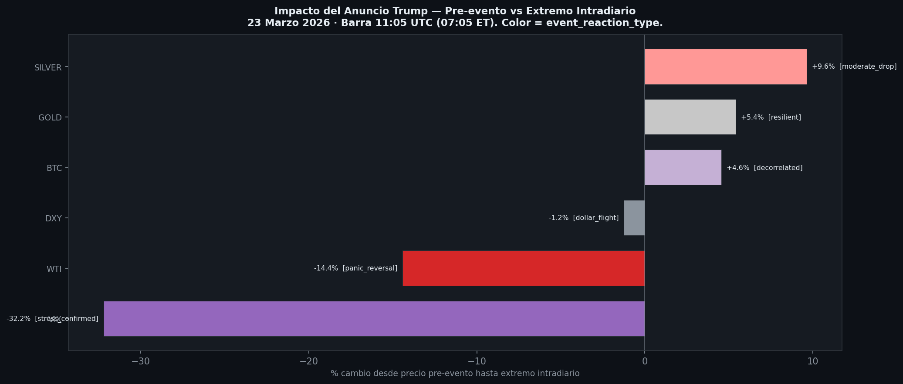

Comparación de cada activo justo antes del tweet (11:05 UTC) y en su valor extremo intradiario. Es la ilustración más directa de las limitaciones del modelo: ningún indicador histórico puede anticipar la publicación de un post en una red social. Documentar su magnitud con precisión es, en sí mismo, una conclusión metodológica.

### Figura 3: Heatmap de señales Polymarket

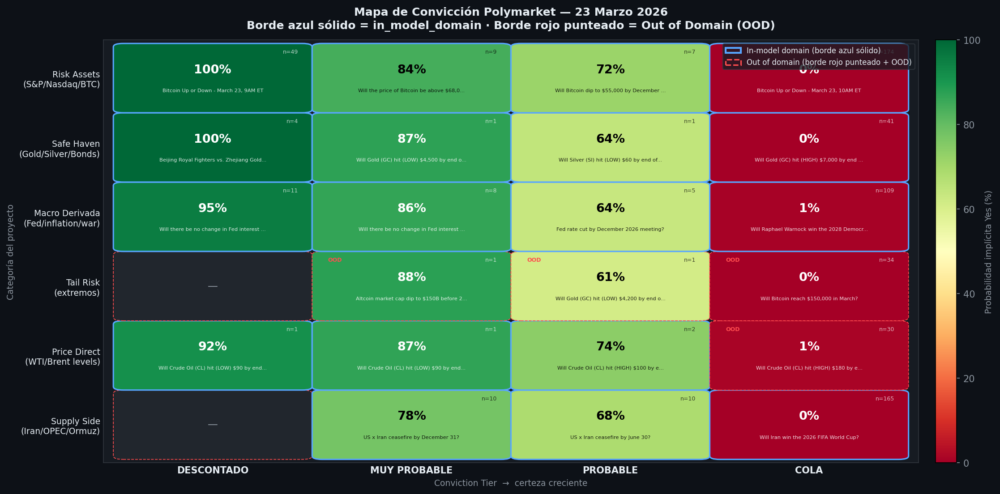

Probabilidades implícitas organizadas por categoría (eje Y) y horizonte temporal (eje X). La predominancia del color frío en las categorías geopolíticas directas (`supply_side`, `price_direct`) frente a la intensidad en `risk_assets` refleja la incertidumbre extrema sobre la evolución del conflicto.

### Figura 4: Ranking por Signal Quality Score

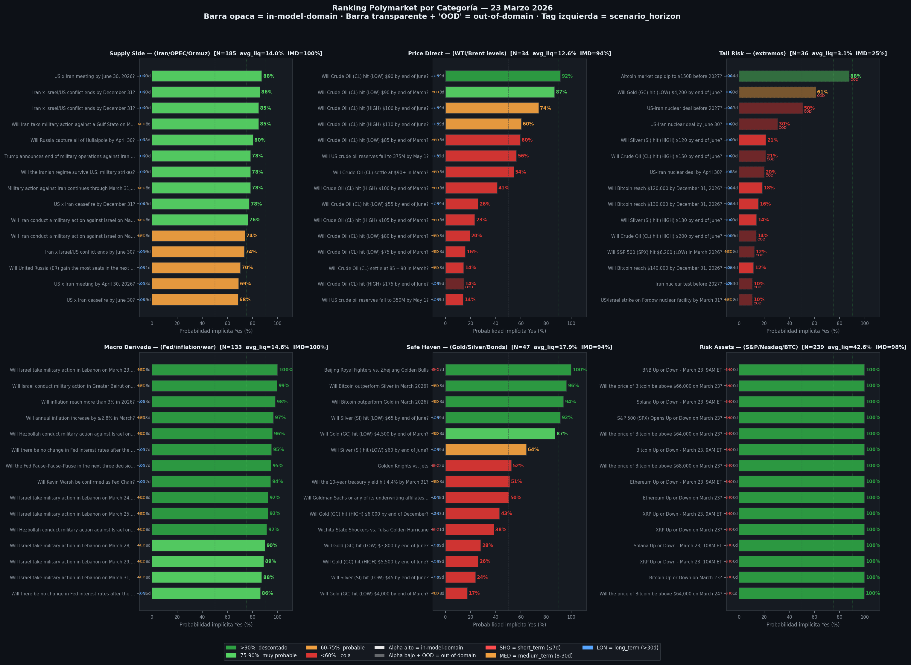

Ranking de los 717 mercados por SQS ajustado. Los primeros puestos corresponden a preguntas sobre cese el fuego, cierre del Estrecho de Ormuz, pausa de la Fed y niveles de precio del WTI —exactamente los mercados de mayor relevancia analítica para el proyecto.

### Figura 5: Curvas de probabilidad implícita

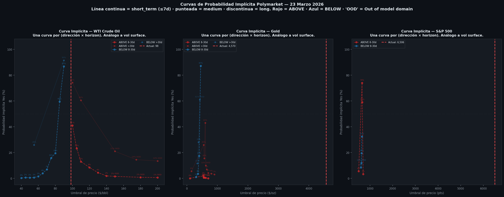

Curvas de probabilidad implícita agrupadas por dirección (above/below) y horizonte temporal para mercados con umbral numérico explícito. La asimetría entre curvas "above" y "below" refleja el sesgo del mercado hacia una eventual corrección del precio desde los niveles actuales, coherente con la divergencia detectada en el motor de inferencia.

### Figura 6: Top mercados para inferencia

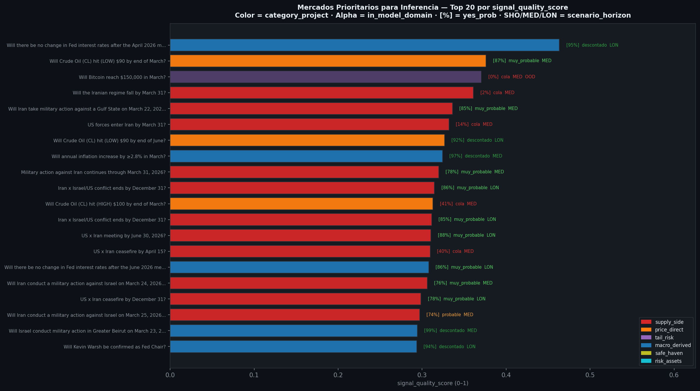

Subconjunto curado de mercados seleccionados para el motor de inferencia (`selection_flag_for_inference = True`). El motor no trabaja con los 717 mercados sino con este subconjunto de mayor SQS ajustado y mayor relevancia geopolítica.

### Figura 7: Mapa de inferencias

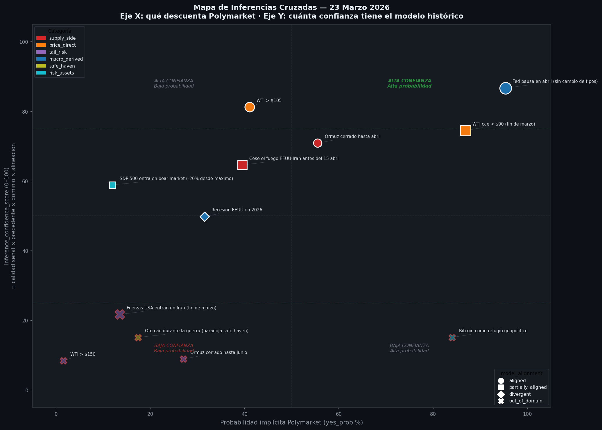

Scatter plot de los doce escenarios: eje X = probabilidad implícita Polymarket; eje Y = `inference_confidence_score`; tamaño = SQS; color = categoría; tipo de marcador = alineación con el modelo. El cuadrante superior derecho (alta probabilidad + alto respaldo del modelo) contiene solo la pausa de la Fed —el único escenario con consenso total entre Polymarket y el historial empírico.

### Figura 8: Intelligence Brief

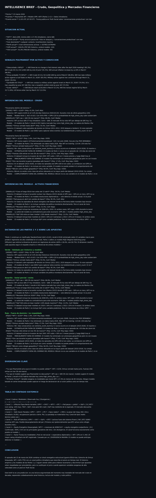

Informe ejecutivo estructurado que sintetiza la situación de mercado, las señales Polymarket, las inferencias del modelo, el dictamen por escenario, las divergencias clave y la tabla de canales de contagio sistémico. Es el entregable final del proyecto.

---

## 7. Conclusiones de la Parte 1

### 7.1 La señal geopolítica existe, pero es débil

El Random Forest con 67 variables alcanza AUC = 0,615 y F1 = 0,571 sobre el conjunto de validación fuera de muestra (2021–2026). Estos resultados superan al clasificador aleatorio (AUC = 0,50) y al modelo lineal de referencia (AUC = 0,578), pero de forma modesta. La señal es estadísticamente distinguible del azar; no es comercialmente explotable de forma directa.

El modelo es **asimétrico por diseño**: con recall = 0,918 y precisión = 0,414, identifica casi todos los shocks reales (91,8% de los días de alta tensión históricos) a costa de una tasa de falsas alarmas elevada (el 59% de las señales no se confirman al día siguiente). Este perfil lo hace útil para cobertura de riesgo —donde el coste de no detectar un shock supera al de una alarma falsa— pero no para estrategias especulativas direccionales.

### 7.2 Las variables de mercado dominan sobre la geopolítica

El hallazgo más relevante de la Parte 1 es que las variables de memoria del propio mercado predicen mejor el crudo que los indicadores geopolíticos externos. Las cinco variables más importantes según SHAP son todas de tipo mercado o VIX/DXY. El primer indicador geopolítico puro aparece en cuarta posición y solo en interacción con OVX.

Este resultado es coherente con la hipótesis de mercados semi-eficientes: la información pública sobre eventos geopolíticos ya ha sido parcialmente descontada en los indicadores de volatilidad implícita. La señal que aún persiste en los datos geopolíticos es marginal, y solo se captura cuando se combina con la señal de mercado (variable `goldstein_x_ovx`).

### 7.3 DXY como indicador adelantado

La presencia del DXY —con rezagos de 1, 3 y 5 días— entre las diez variables más importantes sugiere que el mercado de divisas incorpora la información sobre el riesgo geopolítico con cierta anticipación respecto al crudo. El dólar reacciona antes que el barril, posiblemente porque los flujos de capitales hacia activos refugio (treasuries, dólar) son más ágiles que el reposicionamiento en mercados de futuros de energía.

### 7.4 Los umbrales cuantitativos del modelo

El análisis SHAP y la construcción del modelo producen umbrales empíricamente respaldados que la Parte 3 hereda directamente:

- **OVX > 40:** umbral de alerta principal
- **OVX > 46,1 (P80 high_stress):** zona de alarma elevada
- **GPR > 120 (P75 histórico):** umbral de riesgo geopolítico crítico
- **Goldstein < -3,0:** zona de conflictividad elevada en GDELT
- **VIX > 25:** umbral de estrés financiero macro

Estos umbrales no son elecciones arbitrarias: son los valores en torno a los cuales el Random Forest rompe su árbol de decisión con mayor ganancia de información sobre los cinco años de validación fuera de muestra.

---

## 8. Conclusiones de la Parte 2

### 8.1 El régimen de alta tensión es persistente

El parámetro más relevante del RSJD para la Parte 3 es p_stay = 0,977. Dado un día en régimen de alta tensión, la probabilidad de continuar en ese régimen al día siguiente es del 97,7%. La duración esperada del régimen es de **~43 días**, no de días o semanas. Esta persistencia implica que los shocks en el mercado del crudo no son eventos puntuales que el mercado absorbe en 48 horas: son regímenes de comportamiento estructurado con dinámica propia.

En el contexto del 23 de marzo de 2026, este parámetro apoya la lectura de que el nivel de volatilidad extremo no era transitorio: el régimen activo el día del snapshot podría esperarse durante semanas adicionales, con una deriva alcista del +18,4% anualizado y volatilidad del 50,7%.

### 8.2 La cobertura geopolítica tiene valor económico

El fondo geopolítico diseñado en el ABM —que activa coberturas cuando el clasificador de la Parte 1 emite señal de alerta— reduce el drawdown máximo en un 72% respecto al inversor pasivo. Este dato cuantifica el valor práctico de la señal predictiva: aunque el modelo no "predice el precio", sí permite reducir la exposición a pérdidas extremas en el momento oportuno.

### 8.3 Los límites de la extrapolación del RSJD

El RSJD presenta un error de magnitud del 136,9% para extrapolaciones de varios meses fuera del dominio de calibración. Esta cifra no invalida el modelo: lo sitúa. El RSJD captura correctamente la dinámica cualitativa de los regímenes (alta vs. baja volatilidad, persistencia, saltos) pero falla en la predicción cuantitativa del nivel de precios a horizontes largos. Las rutas de precio que produce el motor de inferencia de la Parte 3 deben leerse como indicadores de dirección y dispersión, no como predicciones de niveles específicos.

### 8.4 La estructura de correlaciones entre activos varía con el régimen

En régimen normal, las correlaciones entre WTI, S&P 500, oro y Bitcoin siguen patrones históricos conocidos. En régimen de alta tensión, esas correlaciones se rompen: el equity energético (XOM, CVX) se desacopla positivamente del S&P general, el oro puede comportarse de forma contraintuitiva por el canal de tipos reales, y activos digitales como Bitcoin pueden actuar como sustitutos parciales del oro como refugio. El ABM modela estas rupturas de correlación como cambios en la función de reacción de los agentes momentum y especulador.

---

## 9. Conclusiones de la Parte 3

### 9.1 El perfil del 23 de marzo de 2026 no tiene precedente

Con OVX en el percentil 98,6 y GPR en el percentil 97,8 sobre historiales de más de quince y cuarenta años respectivamente, y 6 de 8 dimensiones de estrés del modelo activadas simultáneamente, el snapshot del 23 de marzo de 2026 es, en todos los sentidos estadísticos disponibles, un evento de cola extrema. Solo doce precedentes en cuarenta años presentan un swing intradiario de WTI similar (-14%).

El modelo debe declararse **out-of-domain** para los escenarios más extremos —WTI > $150, Ormuz cerrado hasta junio, intervención militar directa de EEUU— y lo hace. Un modelo que responde con confianza alta fuera de su dominio de entrenamiento es un modelo que miente.

### 9.2 La divergencia central: corrección vs. persistencia

La divergencia analíticamente más importante detectada por el motor de inferencia es la del escenario "WTI < $90 antes de fin de marzo":

- **Polymarket:** probabilidad del 86,85% (señal `muy_probable`)
- **Modelo histórico:** OVX en P98,6 y GPR en P97,8 implican presión alcista estructural persistente (recall del modelo: 91,8% de días comparables fueron efectivamente `high_stress`)

La reconciliación requiere reconocer que Polymarket probablemente incorporaba el canal político —posibilidad de acuerdo diplomático rápido— que el modelo histórico no puede capturar por construcción. Ninguno de los dos tenía razón completa: la resolución del conflicto no ocurrió en el plazo esperado por Polymarket, pero tampoco la escalada extrema que el modelo de persistencia sugería.

### 9.3 Lo que los canales de contagio confirman y lo que no

**Canal confirmado sin divergencia:** equity energético desacoplado. XOM +33,6% YTD, CVX +34,8% YTD vs. S&P 500 -4,95% YTD. El historial de la guerra de Ucrania (2022) ya documentaba este patrón; la Parte 3 lo confirma.

**Canal con inversión parcial:** paradoja safe haven. El oro cayó -8,8% intradiariamente en el momento de máximo estrés, cuando la teoría predice que debería subir. La causa fue el canal de tipos reales: la expectativa de pausa de la Fed (95,35% en Polymarket) elevó los tipos reales, presionando el oro a la baja. El canal de refugio eventualmente dominó (oro en zona de máximos históricos en el snapshot), pero con dinámica intradiaria contraintuitiva.

**Canal sin precedente histórico:** factor Trump. Un post en una red social generó el mayor swing intradiario registrado en la historia del contrato de crudo WTI. Este canal no es modelable con ningún enfoque de series temporales históricas. No es una limitación técnica superable con más datos o mejores algoritmos: es una limitación epistemológica del enfoque cuantitativo aplicado a mercados con agentes de influencia asimétrica.

### 9.4 El valor de la integración frente a las fuentes individuales

Ninguna de las tres capas de información es suficiente por sí sola:

- El **historial empírico** (Parte 1 + 2) proporciona umbrales validados y dinámica de régimen, pero no puede actualizar sus estimaciones ante eventos sin precedente.
- **Polymarket** proporciona expectativas actuales del mercado, pero con sesgos de participación, liquidez limitada en mercados geopolíticos específicos, y susceptibilidad al canal político de corto plazo.
- La **integración** revela las divergencias: y esas divergencias —no las señales individuales— son la información analíticamente más valiosa del proyecto.

### 9.5 El límite metodológico fundamental

El evento más importante del 23 de marzo de 2026 fue causado por una publicación en una red social. Reconocer explícitamente este límite —que ningún modelo cuantitativo basado en series temporales puede anticipar la decisión de un individuo de publicar un mensaje específico en un momento específico— es, posiblemente, la conclusión metodológica más valiosa del proyecto.

---

## 10. Interpretación integrada

Este proyecto demuestra que es posible construir una arquitectura analítica coherente que va desde la ingeniería de datos históricos hasta la inferencia en tiempo real sobre eventos de mercado extremos. Los resultados son honestos en sus limitaciones.

**Lo que el proyecto demuestra:**
- La señal geopolítica cuantitativa existe y es estadísticamente significativa (AUC = 0,615), pero la información pública ya está parcialmente descontada en los indicadores de volatilidad de mercado.
- Los regímenes de alta tensión en el crudo son persistentes (p_stay = 0,977, duración ~43 días) y tienen una estructura dinámica específica que el RSJD captura correctamente de forma cualitativa.
- El cruce de señales históricas con mercados de predicción en tiempo real produce divergencias que no son ruido: son puntos de tensión entre el conocimiento empírico del pasado y las expectativas del mercado sobre el futuro.

**Lo que el proyecto no hace:**
- No predice el precio del crudo. Clasifica condiciones que históricamente han precedido a días de alta tensión.
- No valida Polymarket como fuente primaria de predicción. Lo usa como capa auxiliar con cautela metodológica explícita.
- No modela el factor Trump ni ningún equivalente. Esto no es una limitación técnica: es una característica del entorno.

**Líneas futuras:**
- Incorporar la estructura de volatilidad implícita en opciones sobre crudo (skew, term structure) como señal complementaria al OVX de nivel.
- Extender el análisis de contagio sistémico con correlaciones rodantes entre activos para detectar cambios de régimen en la estructura de correlación del sistema financiero.
- Ampliar el universo de mercados de predicción más allá de Polymarket (Metaculus, Kalshi) para controlar el sesgo de composición de participantes.
- Explorar el procesamiento en tiempo real de noticias geopolíticas mediante LLM para construir indicadores de sentimiento con menor latencia que el GDELT.

---

---

## 11. Bloque 6 — Comparativa Ucrania 2022 vs. EEUU-Irán 2026

El precedente más cercano al escenario del 23 de marzo de 2026 es la invasión rusa de Ucrania (24 de febrero de 2022). Ambos son guerras activas con impacto directo en infraestructura energética y OVX/GPR en percentiles extremos. Este bloque construye una comparación estructurada que permite contrastar empíricamente si los parámetros del RSJD son realistas y qué diferencia estructural introduce el bloqueo del Estrecho de Ormuz.

### 11.1 Trayectoria normalizada WTI, OVX y VIX

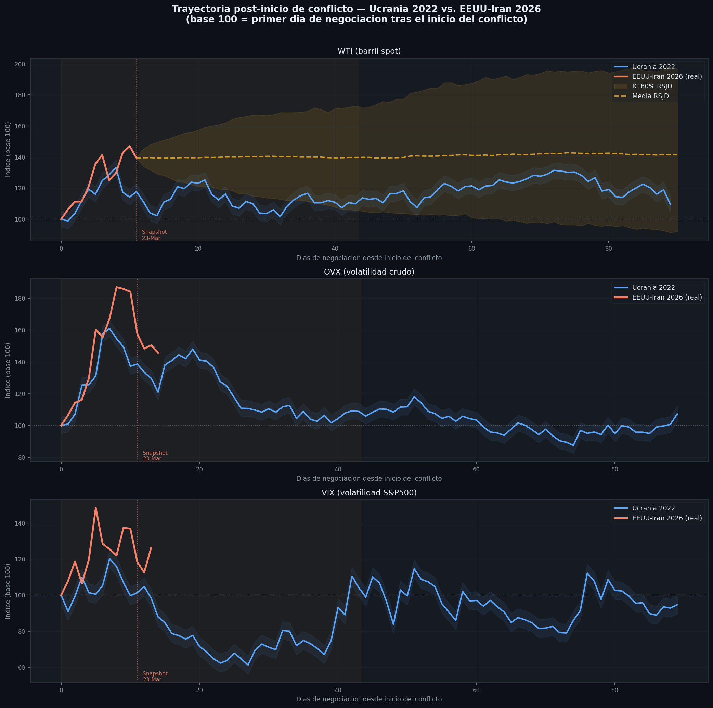

**Qué representa:** Evolución de WTI, OVX y VIX en los 90 días de negociación siguientes al inicio de cada conflicto, normalizados a 100 en el día 0. La proyección RSJD con IC 80% (banda dorada) se añade desde el último dato observado del episodio actual (día 17, snapshot del 23 de marzo).

**Qué lectura se extrae:**

- El episodio de 2026 arranca con una aceleración de WTI más pronunciada (+47% en los primeros 17 días vs. +33% en la ventana equivalente de Ucrania), pero con un OVX que ya estaba elevado el día 0 (64,7 vs. 49,0 en Ucrania). El mercado del crudo entró en el conflicto de 2026 con la volatilidad implícita ya en zona de estrés, no desde un nivel tranquilo.
- La proyección RSJD muestra continuidad del régimen como escenario central, pero el IC 80% es amplio: la incertidumbre sobre el nivel de precios a 30–60 días es comparable a la dispersión del modelo.
- VIX: el episodio de 2026 muestra menor reacción del VIX que Ucrania, confirmando el patrón de shock sectorial sin crisis financiera global.

### 11.2 Trayectoria GPR: ambos episodios

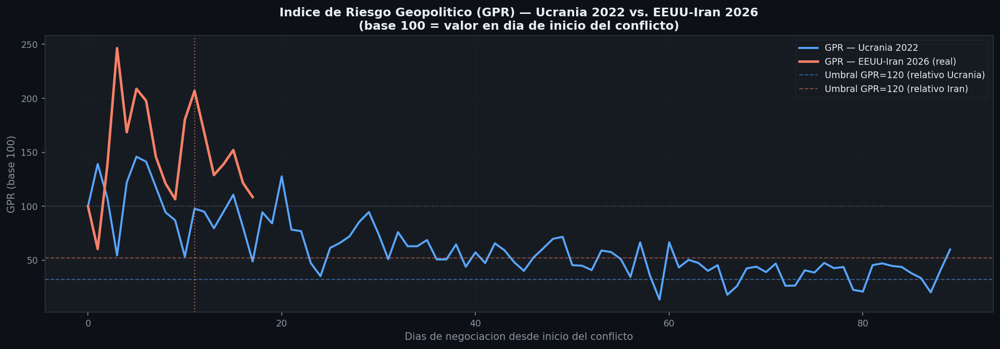

**Qué representa:** Índice de Riesgo Geopolítico (GPR) en los días siguientes a cada inicio de conflicto (base 100 en día 0). Las líneas discontinuas marcan el umbral crítico del modelo (GPR > 120) relativizado a cada episodio.

**Qué lectura se extrae:** Ambos episodios superan el umbral crítico desde el día 0. La diferencia está en la estructura inicial: en Ucrania el GPR arrancó desde 370,7 (ya muy elevado), con un escalón brusco al inicio; en el episodio actual partía de 229,3, con una escalada más progresiva. El máximo en ambos casos alcanzó el percentil ~100 del histórico desde 1985.

### 11.3 Calibración empírica del RSJD: duración real del régimen en Ucrania 2022

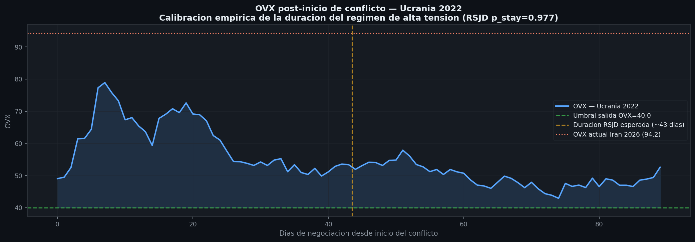

**Qué representa:** OVX durante los 90 días posteriores al inicio de la guerra de Ucrania. Se señala el umbral de salida del modelo (OVX < 40 durante 5 días consecutivos), la duración esperada del RSJD (~43 días) y el OVX actual del episodio de 2026 como referencia.

**Resultado crítico:** El régimen de alta tensión en Ucrania **no salió** del umbral OVX > 40 en los primeros 90 días de negociación. El RSJD predice una duración esperada de ~43 días, que resultó ser una subestimación significativa para el episodio ucraniano. Esto valida empíricamente la advertencia de la Parte 2: el error de magnitud del 136,9% en extrapolación no es teórico, es observable sobre el único precedente relevante.

### 11.4 Tabla comparativa de episodios

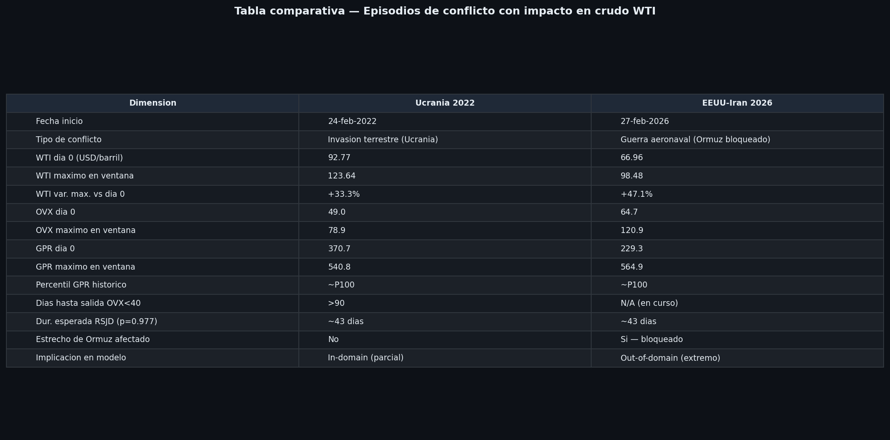

| Dimensión | Ucrania 2022 | EEUU-Irán 2026 |
|-----------|-------------|----------------|
| Fecha inicio | 24-feb-2022 | 27-feb-2026 |
| Tipo de conflicto | Invasión terrestre | Guerra aeronaval (Ormuz bloqueado) |
| WTI día 0 (USD/barril) | 92,77 | 66,96 |
| WTI máximo en ventana | 123,64 | 98,48 |
| WTI var. max. vs día 0 | +33,3% | +47,1% |
| OVX día 0 | 49,0 | 64,7 |
| OVX máximo en ventana | 78,9 | 120,9 |
| GPR día 0 | 370,7 | 229,3 |
| GPR máximo en ventana | 540,8 | 564,9 |
| Percentil GPR histórico | ~P100 | ~P100 |
| Días hasta salida OVX < 40 | >90 | N/A (en curso) |
| Duración esperada RSJD | ~43 días | ~43 días |
| Estrecho de Ormuz afectado | No | Sí — bloqueado |
| Implicación en modelo | In-domain (parcial) | Out-of-domain (extremo) |

**Diferencia estructural clave:** El bloqueo del Estrecho de Ormuz en 2026 elimina el mecanismo de sustitución de rutas de suministro que existía en el episodio ucraniano. En 2022 el mercado podía redirigir flujos; en 2026 el 20% del comercio mundial de crudo no tiene ruta alternativa. Esta asimetría sitúa el escenario actual de forma más definitiva fuera del dominio de calibración del modelo.

---

## 12. Bloque 7 — Análisis de Correlaciones Rodantes

Las correlaciones entre activos financieros no son estables: cambian con el régimen. Un shock energético extremo reorganiza las relaciones entre el crudo, la volatilidad, el dólar y la renta variable de forma que los modelos calibrados sobre periodos tranquilos no anticipan. Este bloque cuantifica esa reorganización en tres sub-bloques.

### 12.1 Correlaciones rodantes (ventana 30 días, 2020–2026)

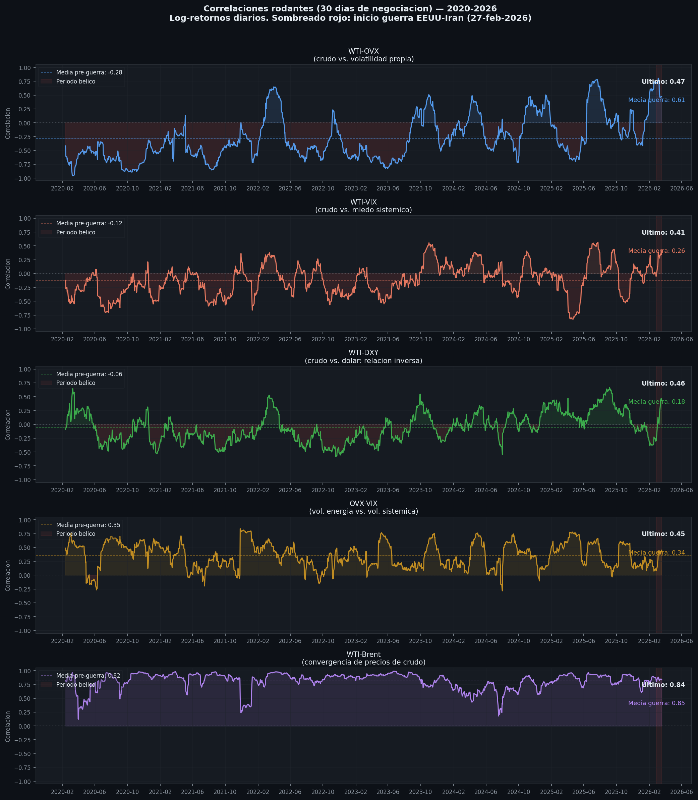

**Qué representa:** Correlación rodante de 30 días entre 5 pares clave, calculada sobre log-retornos diarios desde enero de 2020 hasta el snapshot. La zona sombreada en rojo marca el inicio de la guerra EEUU-Irán (27-feb-2026).

**Rupturas cuantificadas:**

| Par | Media pre-guerra | Media guerra | Delta | Tipo |
|-----|-----------------|--------------|-------|------|
| WTI-OVX | -0,285 | +0,606 | **+0,890** | Inversión de signo |
| WTI-VIX | -0,122 | +0,260 | +0,382 | Ruptura fuerte |
| WTI-DXY | -0,059 | +0,177 | +0,236 | Ruptura moderada |
| OVX-VIX | +0,355 | +0,345 | -0,010 | Estable |
| WTI-Brent | +0,816 | +0,846 | +0,030 | Estable |

La cifra más llamativa es la del par WTI-OVX: **el signo se invierte**. Pre-guerra, en retornos diarios, cuando el crudo subía tendía a hacerlo mientras la volatilidad implícita caía (mercado alcista tranquilo). Durante la guerra, ambos suben y bajan juntos: el crudo y su volatilidad implícita se han sincronizado en el régimen de estrés extremo.

La relación inversa estructural WTI-DXY (crudo en dólares: dólar fuerte → crudo caro para compradores externos → demanda cae → precio baja) también se debilita durante la guerra, cuando los movimientos de ambos activos pasan a estar co-determinados por el factor geopolítico común.

### 12.2 Matrices de correlación: pre-bélico vs. periodo bélico vs. delta

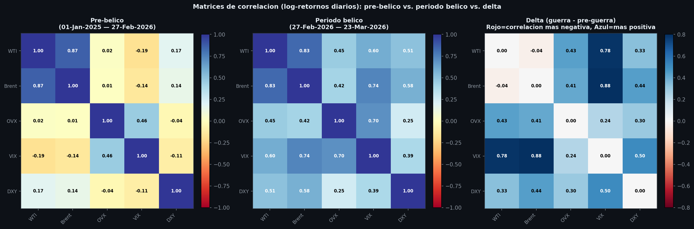

**Qué representa:** Tres matrices de correlación (log-retornos diarios) lado a lado: periodo pre-bélico (2025-01-01 a 2026-02-26, 298 días), periodo bélico (2026-02-27 a 2026-03-23, 15 días), y delta (diferencia entre ambas).

**Qué lectura se extrae del panel delta:** Prácticamente todos los pares aumentan su correlación durante la guerra. La excepción notable es WTI-Brent, que ya era muy alta antes (+0,867) y se mantiene estable. El sistema financiero se comporta como un bloque más correlacionado en el régimen de estrés: cuando el crudo sube, todo sube; cuando cae (evento Trump), todo cae juntos. Esto reduce las posibilidades de diversificación intra-cartera durante el régimen de alta tensión.

Las correlaciones más afectadas en el delta son precisamente las que cruzan el crudo con activos financieros: WTI-VIX (+0,784), Brent-VIX (+0,882), WTI-DXY (+0,332). El canal de transmisión energía → sistema financiero opera a través de estas correlaciones, que se activan de forma sincrónica.

### 12.3 Heatmap completo del periodo bélico (13 activos)

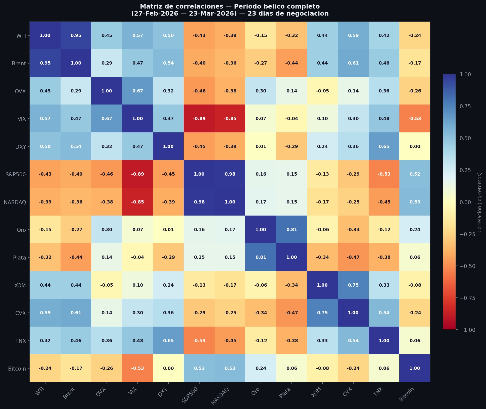

**Qué representa:** Matriz de correlación de los 13 activos del snapshot durante el periodo bélico completo (17 días de negociación), construida sobre log-retornos diarios de los parquets yfinance.

**Correlaciones destacadas (|r| > 0,60):**

| Par | Correlación | Interpretación |
|-----|-------------|----------------|
| WTI-Brent | +0,953 | Prácticamente perfecta — spread comprimido en shocks extremos |
| S&P500-NASDAQ | +0,985 | Renta variable como bloque sincronizado |
| VIX-S&P500 | -0,886 | Canal inverso clásico, reforzado durante la guerra |
| Oro-Plata | +0,807 | Metales preciosos como bloque de refugio unificado |
| XOM-CVX | +0,752 | Equity energético acoplado — canal de contagio confirmado del Bloque 4.5 |
| DXY-TNX | +0,653 | Dólar y yields de bonos juntos: canal de política monetaria activo |

**Nota metodológica:** Con solo 17 días de negociación en el periodo bélico, estas correlaciones deben interpretarse como indicativas de la dinámica del periodo, no como estimaciones robustas de largo plazo. La reducción de la ventana de estimación amplifica la varianza de cada coeficiente.

---

## 13. Sub-bloque 4.6 — Semáforo de Salida del Régimen de Alta Tensión

El motor de inferencia del Bloque 4 analiza escenarios dentro del régimen de estrés. Este sub-bloque responde la pregunta simétrica: **¿qué condiciones cuantitativas indicarían una transición de vuelta al régimen normal?** Un sistema de alerta honesto debe definir explícitamente cuándo dejar de estar en alerta.

### 13.1 Condiciones de salida y estado actual

Se definen cuatro condiciones basadas en los umbrales del Random Forest (Parte 1) y ponderadas por importancia SHAP:

| Condición | Umbral | Peso SHAP | Valor actual | Brecha | Satisfecha |
|-----------|--------|-----------|-------------|--------|------------|
| OVX < 40 (umbral alerta modelo) | 40,0 | 30% | 91,85 | +51,85 | NO |
| OVX < 46,1 (P80 high_stress) | 46,1 | 30% | 91,85 | +45,75 | NO |
| GPR < 120 (umbral crítico) | 120,0 | 20% | 248,83 | +128,83 | NO |
| VIX < 25 (estrés macro) | 25,0 | 20% | 26,78 | +1,78 | NO |

**Criterio compuesto:** todas las condiciones deben cumplirse durante 5 días hábiles consecutivos para declarar salida del régimen.

### 13.2 Semáforo visual: estado actual

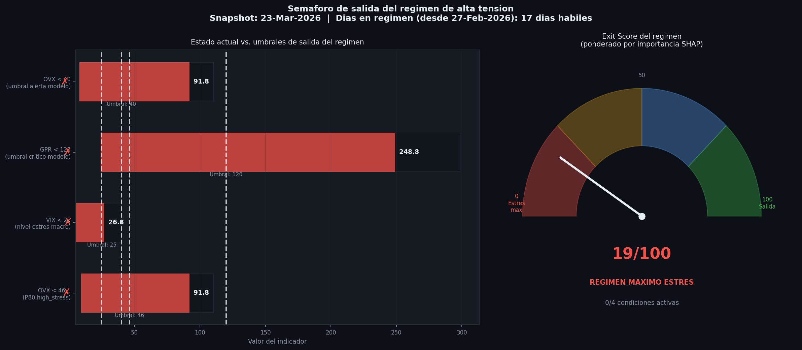

**Exit Score: 18,8/100 → RÉGIMEN MÁXIMO ESTRÉS | 0 de 4 condiciones satisfechas**

**Qué lectura se extrae:** El indicador más cercano a su umbral es VIX (+1,78 puntos sobre el umbral de 25): el estrés financiero sistémico es moderado incluso con OVX en percentil 98,6. Esto es el patrón exacto de un shock sectorial sin crisis financiera global, coherente con el análisis de canales de contagio del Bloque 4.5. El indicador más alejado de su umbral es GPR: necesita reducirse un 52% desde su nivel actual para entrar en zona de transición.

Para que el semáforo pase a amarillo ("señales parciales") bastaría con que VIX cayese por debajo de 25. Para que pase a verde ("salida inminente"), OVX necesitaría caer de 91,85 a menos de 40 — una reducción del 56% desde el nivel del snapshot.

### 13.3 Precedente histórico: distribución de duraciones

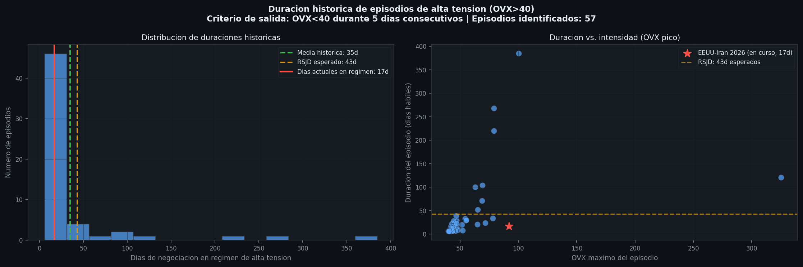

**Qué representa:** Panel izquierdo: distribución histórica de la duración de episodios OVX > 40 (57 episodios desde 2007). Panel derecho: scatter duración vs. OVX pico del episodio, con el episodio actual marcado.

| Estadístico | Valor |
|-------------|-------|
| Episodios identificados (OVX > 40) | 57 |
| Duración media | 34,9 días |
| Duración mediana | 10,0 días |
| Duración máxima | 385 días (crisis 2008) |
| Duración mínima | 6 días |
| Predicción RSJD (p_stay = 0,977) | ~43 días |
| Días actuales en régimen (snapshot) | 17 días |
| Percentil del episodio actual | P61 |

**Qué lectura se extrae:** El episodio actual (17 días en el snapshot) se encuentra en el percentil 61 de la distribución histórica: el 39% de los episodios históricos ya habrían terminado. Sin embargo, el panel derecho revela una asimetría crucial: los episodios con OVX máximo superior a 90 —como el actual, con OVX máximo de 120,9— tienden a durar significativamente más que la mediana. El único precedente con OVX comparable es el pico de COVID-2020 (OVX máximo: 325), que duró varios meses.

El RSJD predice ~43 días: por encima de la media histórica (34,9) pero coherente con la severidad del episodio. La comparación con el precedente ucraniano (no salió del umbral en 90 días) sugiere que la predicción del RSJD puede ser una subestimación para este tipo de conflictos prolongados.

**Conclusión del sub-bloque:** Con 0 de 4 condiciones de salida satisfechas y el indicador principal (OVX) necesitando reducirse un 56% para alcanzar su umbral, el modelo no puede declarar proximidad a una transición de régimen en el snapshot del 23 de marzo de 2026. Esta es la respuesta metodológicamente correcta: un sistema de alerta que no sabe cuándo apagarse no es un sistema de alerta.

---

## 14. Estructura de carpetas

```
.
├── notebooks/
│   ├── parte3_completo.ipynb              ← Notebook unificado (5 bloques)
│   ├── 01_polymarket_ingesta.ipynb
│   ├── 02_market_snapshot.ipynb
│   ├── 03_polymarket_taxonomia.ipynb
│   ├── 04_inference_engine.ipynb
│   └── 05_intelligence_brief_dashboard.ipynb
├── scripts/
│   ├── patch_bloque1.py                   ← Columnas operativas Bloque 1
│   ├── patch_bloque2.py                   ← Columnas operativas Bloque 2
│   ├── patch_bloque3.py                   ← Figuras mejoradas Bloque 3
│   ├── bloque4_inference.py               ← Motor de inferencia completo
│   ├── bloque4_6_exit_signal.py           ← Semáforo de salida del régimen
│   ├── bloque5_dashboard.py               ← Brief ejecutivo
│   ├── bloque6_ukraine_comparison.py      ← Comparativa Ucrania 2022 vs. Iran 2026
│   └── bloque7_rolling_correlations.py    ← Correlaciones rodantes y matrices
├── data_clean/
│   ├── wti_usa_clean.csv                  ← WTI spot 1986-2026
│   ├── ovx_clean.csv                      ← OVX 2007-2026
│   ├── gpr_clean.csv                      ← GPR 1985-2026
│   ├── gdelt_clean.csv                    ← GDELT eventos 2015-2026
│   ├── vix_clean.csv
│   ├── dxy_clean.csv
│   ├── brent_clean.csv
│   └── events_timeline_clean.csv
├── context/
│   ├── README_parte1.md                   ← Metodología y resultados Parte 1
│   ├── README_parte2.md                   ← Metodología y resultados Parte 2
│   ├── model_summary.json                 ← Resumen del modelo predictivo
│   └── master_dataset_schema.json         ← Esquema del dataset maestro
└── outputs/
    ├── data/parte3/
    │   ├── polymarket_clean.parquet        ← 717 mercados clasificados
    │   ├── market_snapshot_20260323.parquet
    │   ├── inference_table.parquet         ← 12 escenarios, 29 columnas
    │   ├── intelligence_brief.md
    │   └── contagion_channels.json
    └── figures/parte3/
        ├── market_snapshot.png
        ├── pre_post_trump.png
        ├── polymarket_heatmap.png
        ├── polymarket_ranking.png
        ├── polymarket_implied_curve.png
        ├── polymarket_top_inference.png
        ├── inference_map.png
        ├── intelligence_brief.png
        ├── bloque4_6_semaforo_salida.png
        ├── bloque4_6_duracion_regimen.png
        ├── bloque6_trayectoria_normalizada.png
        ├── bloque6_gpr_comparativa.png
        ├── bloque6_rsjd_calibracion.png
        ├── bloque6_tabla_comparativa.png
        ├── bloque7_correlaciones_rodantes.png
        ├── bloque7_matrices_correlacion.png
        └── bloque7_heatmap_belico_completo.png
```

---

## 15. Reproducibilidad

### Dependencias principales

```
pandas >= 2.0
numpy >= 1.24
scikit-learn >= 1.3
matplotlib >= 3.7
yfinance >= 0.2
requests >= 2.31
pyarrow >= 13.0
nbformat >= 5.9
nbclient >= 0.8
```

### Orden de ejecución

```bash
# Desde la raíz del repositorio

# Bloque 1: Ingesta Polymarket
python scripts/patch_bloque1.py

# Bloque 2: Snapshot de mercado (requiere conexión a yfinance)
python scripts/patch_bloque2.py

# Bloque 3: Taxonomía y figuras
python scripts/patch_bloque3.py

# Bloque 4: Motor de inferencia
python scripts/bloque4_inference.py

# Sub-bloque 4.6: Semáforo de salida del régimen
python scripts/bloque4_6_exit_signal.py

# Bloque 5: Brief ejecutivo
python scripts/bloque5_dashboard.py

# Bloque 6: Comparativa Ucrania 2022 vs. EEUU-Irán 2026
python scripts/bloque6_ukraine_comparison.py

# Bloque 7: Análisis de correlaciones rodantes
python scripts/bloque7_rolling_correlations.py
```

Los notebooks individuales pueden ejecutarse en orden (01 → 05) o directamente a través del notebook unificado `parte3_completo.ipynb`. El notebook unificado gestiona la dependencia entre bloques mediante archivos parquet intermedios en `outputs/data/parte3/`.

### Notas sobre reproducibilidad

Los datos de Polymarket y yfinance se descargan en tiempo real. Para reproducir el snapshot exacto del 23 de marzo de 2026 es necesario usar los parquets guardados en `outputs/data/parte3/`, no re-ejecutar la descarga, ya que los precios y probabilidades actuales serán distintos. Los datos geopolíticos (GPR, GDELT) son estables y reproducibles desde sus fuentes originales.

---

*Proyecto de portfolio — Master AFI Madrid · Análisis cuantitativo de mercados energéticos y geopolíticos · 2026*
